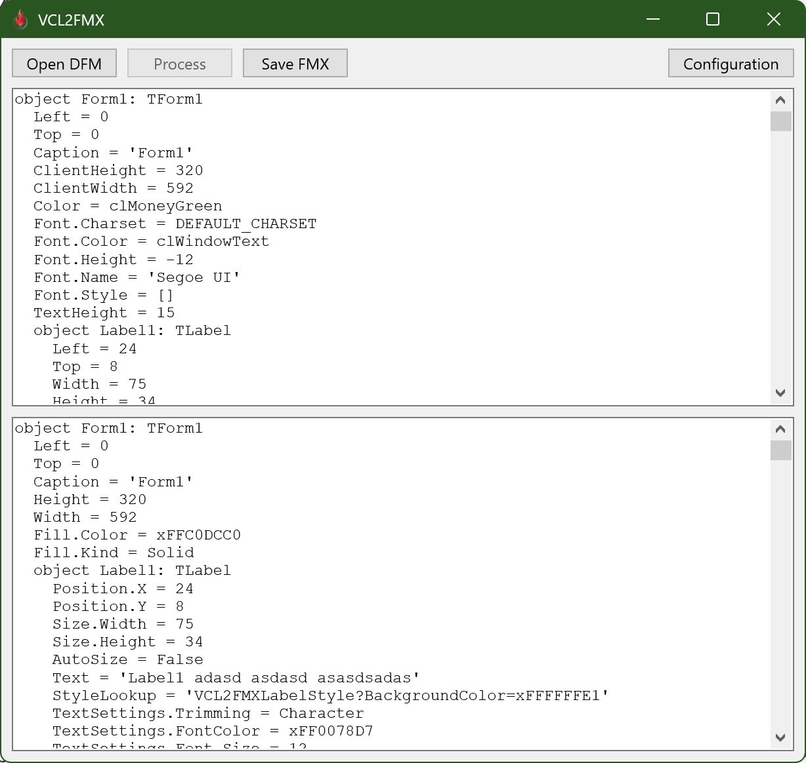
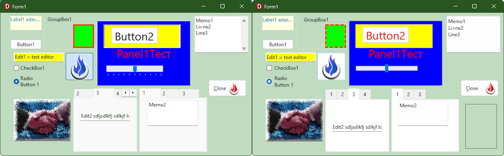

# VCL to FireMonkey form converter

The aim of this project is to help you to convert your existing VCL forms to FireMonkey framework, automating as much work as possible. Some changes in Pas-file are also made, but they are related only to form itself, all logic stays intact, so do not expect to have a fully working app after conversion.

Here you can see a demo converted to FMX:

You should remember, that FMX framework puts all responsibility for external looks of the controls on styles, so, for example, buttons do not even have properties to select icon size or position. This should be handled by styles. Lets imagine, that your app uses four different icon sizes, these icons can be in three different positions, and button can be either normal or a speedbutton. This means that you will have to create 4 * 3 * 2 = 24 separate custom styles just for buttons. This would be a nightmare to maintain, that is why this project also provides a few custom styles in "Style Generation" folder. These styles are special because they allow you to tweak how they look. For example for buttons you can select one of four icon positions and any icon size.

To select some style, you need to enter its name into StyleLookup property of the control, like this:

    StyleLookup = 'VCL2FMXButtonStyle'
If you want icon to be on top of the text, you can add a parameter:

    StyleLookup = 'VCL2FMXButtonStyle?GlyphPosition=Top'
If you need two parameters, than you can specify them like this:

    StyleLookup = 'VCL2FMXButtonStyle?GlyphSize=64&GlyphPosition=Top'
As you probably already guessed, URL parsing code is used here, so all rules for parameters are the same.

When a control asks for that style, it will be built on the fly, according to provided parameters.

How these styles look, you ask? - Like regular VCL controls, because they use Windows Theme API. However implementation is quite simple, so it is possible to find differences. Also amount of supported controls is rather small at the moment. Below is a full list of styles with details about supported parameters.

## Styles and their parameters

### VCL2FMXButtonStyle

A style for simple TButton control, supports two parameters:
| Parameter | Possible values | Description |
|--|--|--|
| GlyphPosition | top, right, bottom, left | Position of the icon glyph relative to the text caption. Default value is left |
| GlyphSize | any integer or fractional number | Width and height of the glyph. Default value is 16 |

### VCL2FMXCheckBoxStyle

A style for TCheckBox control, supports one parameter:
| Parameter | Possible values | Description |
|--|--|--|
| BackgroundColor| any color definition, supported by System.UIConsts.StringToAlphaColor | Color of control background. By default background is transparent |

### VCL2FMXEditStyle

A style for TEdit control, supports one parameter:
| Parameter | Possible values | Description |
|--|--|--|
| BackgroundColor| any color definition, supported by System.UIConsts.StringToAlphaColor | Color of control background, behind text. By default background is drawn according to the windows theme |

### VCL2FMXGroupBoxStyle

A style for TGroupBox control, supports two parameters:
| Parameter | Possible values | Description |
|--|--|--|
| BackgroundColor | any color definition, supported by System.UIConsts.StringToAlphaColor | Color of control background. By default background is transparent |
| ShowFrame | boolean value supported by System.SysUtils.StrToBoolDef | Whether to show frame or not. Default value is true |

### VCL2FMXLabelStyle

A style for TLabel control, supports one parameter:
| Parameter | Possible values | Description |
|--|--|--|
| BackgroundColor| any color definition, supported by System.UIConsts.StringToAlphaColor | Color of control background. By default background is transparent |

### VCL2FMXMemoStyle

A style for TMemo control, supports one parameter:
| Parameter | Possible values | Description |
|--|--|--|
| BackgroundColor| any color definition, supported by System.UIConsts.StringToAlphaColor | Color of control background, behind text. By default background is drawn according to the windows theme |

### VCL2FMXPanelStyle

A style for TPanel control, supports one parameter:
| Parameter | Possible values | Description |
|--|--|--|
| BackgroundColor| any color definition, supported by System.UIConsts.StringToAlphaColor | Color of control background. Default color is $FFF0F0F0 |

### VCL2FMXRadioButtonStyle

A style for TRadioButton control, supports one parameter:
| Parameter | Possible values | Description |
|--|--|--|
| BackgroundColor| any color definition, supported by System.UIConsts.StringToAlphaColor | Color of control background. By default background is transparent |

### VCL2FMXScrollBoxStyle

A style for TScrollBox control, supports one parameter:
| Parameter | Possible values | Description |
|--|--|--|
| BackgroundColor | any color definition, supported by System.UIConsts.StringToAlphaColor | Color of control background. By default background is transparent |

### VCL2FMXSpeedButtonStyle

A style for TSpeedButton control, supports two parameters:
| Parameter | Possible values | Description |
|--|--|--|
| GlyphPosition | top, right, bottom, left | Position of the icon glyph relative to the text caption. Default value is left |
| GlyphSize | any integer or fractional number | Width and height of the glyph. Default value is 16 |

## Class helpers for styles

All styles above have corresponding class helpers, that allow you to keep some of the old code without rewriting. For example you had such code:

    Edit1.Color := clRed;
TEdit in FMX does not have Color property, but thanks to class helper, you can keep this code:

    Edit1.Color := claRed;
The only thing that you need to change here is a switch from regular color to alphacolor, clRed -> claRed. Maybe in future converter will be able to do such replacements automatically.

Under the hood these class helpers read and write StyleLookup property of the control, adding style parameters when necessary.
